# Tasks to be performed
##### on link [https://www.educative.io](https://www.educative.io)

### Table of Contents
- [Tasks to be performed](#tasks-to-be-performed)
        - [on link https://www.educative.io](#on-link-httpswwweducativeio)
    - [Table of Contents](#table-of-contents)
    - [Google drive and extension setup](#google-drive-and-extension-setup)
    - [Folder structure](#folder-structure)
    - [Action to be taken on the topic-webpage](#action-to-be-taken-on-the-topic-webpage)
    - [with image explanation of the same](#with-image-explanation-of-the-same)

### Google drive and extension setup

1.	Upload in google drive to a dedicated folder of ak007patra@gmail.com
2.	Link for chrome extension: [extension link](https://chrome.google.com/webstore/detail/full-page-screen-capture/fdpohaocaechififmbbbbbknoalclacl?hl=en)
4.	Use this extension to capture screenshot then CTRL + S to save it. 

### Folder structure

1.	Main folder with name : educative_courses
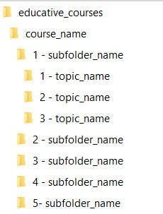
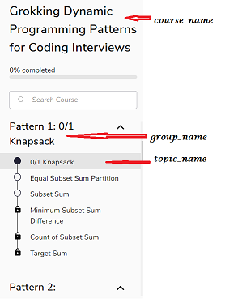
2.	All codes should be in **java** (mandatorily ) if options available

### Action to be taken on the topic-webpage

1. Look for ALL **step wise explanations** in the page.
For each step wise explanation :  click maximize then (+).  Take separate screenshot of  the explanation. click (-) , then minimize.
2. Look for ALL **show hint** and ONE **show solution**. Click on each "show hint", click on "show solution" , then "no just show solution". take screenshot.

So total no. of screenshots = no. of step wise explanation + 1 (which is the same page u are on) .

3. Look for ALL **black-background texts**. For each black-background texts : copy texts, create new file named "1.txt". paste and save it. 
Files should be saved as the order they appear in the topic webpage. File names be like : 1.txt, 2.txt. 3.txt etc.

So total no. of txt files = no. of black-background texts in the same page u are on.

_**So total no. of files in a topic folder = no. of screenshots +  no. of black-background texts**_

### with image explanation of the same
1. Look for ALL **step wise explanations** in the page. 
For each step wise explanation :   
**click maximize**
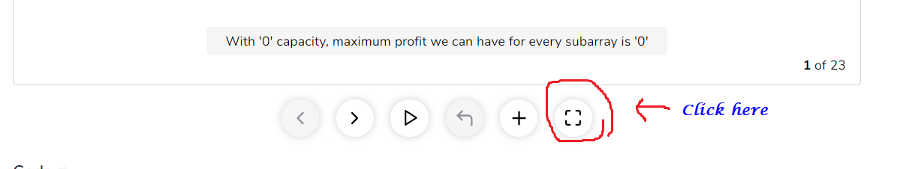 
**then (+).**
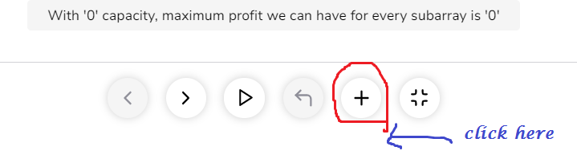 

  Take separate screenshot of  the explanation.
   **click (-)**
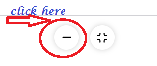 
   then minimize.
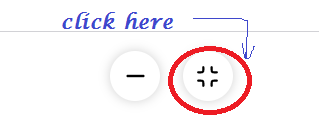 

1. Look for ALL **show hint** and ONE **show solution**  
**Click on each "show hint",**
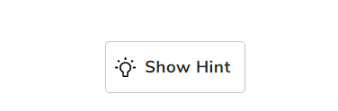 
 **click on "show solution"**
 
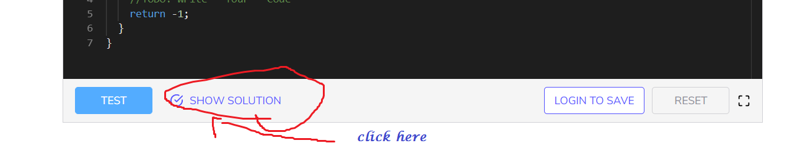 

 **then "no just show solution".**
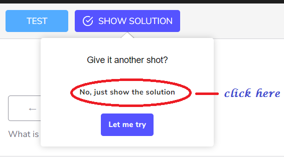 
 
  **take screenshot.**

So total no. of screenshots = no. of step wise explanation + 1 (which is the same page u are on) .

1. Look for ALL **black-background texts**. For each black-background texts : copy texts, create new file named "1.txt". paste and save it. 
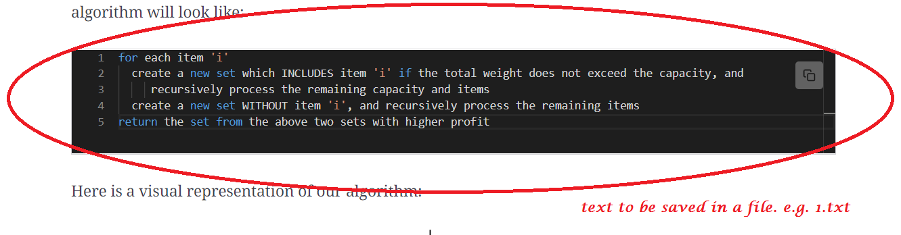 
   
Files should be saved as the order they appear in the topic webpage. File names be like : 1.txt, 2.txt. 3.txt etc.

So total no. of txt files = no. of black-background texts in the same page u are on.

_**So total no. of files in a topic folder = no. of screenshots +  no. of black-background texts**_
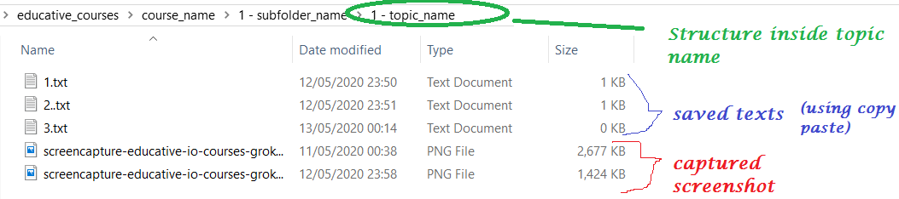 

:thumbsup: